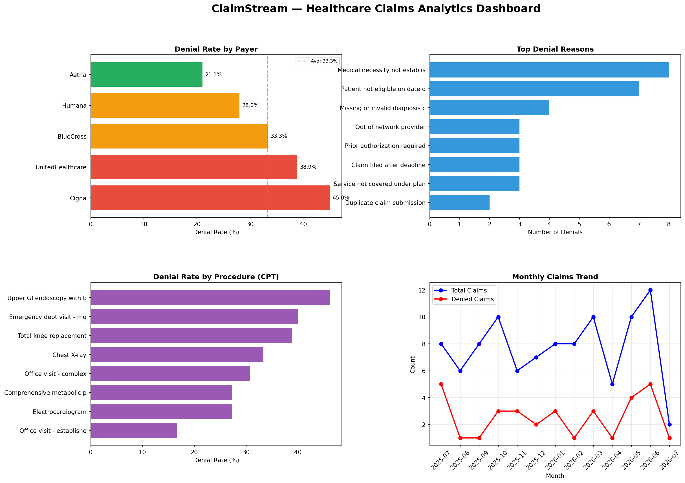

# 🏥 ClaimStream

> Real-time healthcare claims ingestion pipeline — PySpark Structured Streaming, Delta Lake medallion architecture, and analytics dashboard.

**GitHub:** https://github.com/Sakshi3027/claimstream  
**Stack:** Python · PySpark · Delta Lake · Spark Structured Streaming · Matplotlib

---

## What It Does

ClaimStream is the data engineering layer that feeds an AI system like HealthClaim Copilot. It ingests healthcare insurance claims in real-time, applies a bronze-silver-gold medallion architecture, and produces analytics-ready gold tables.

---

## Architecture

Claims Producer (Python)
↓
JSON Stream Files
↓
┌─────────────────────┐
│   BRONZE LAYER      │  Raw ingestion — no transformation, full audit trail
│   Spark Streaming   │  Reads stream → writes to Delta Lake as-is
└─────────┬───────────┘
↓
┌─────────────────────┐
│   SILVER LAYER      │  Cleaning + validation + enrichment
│   PySpark           │  Type casting, null filtering, derived columns
└─────────┬───────────┘
↓
┌─────────────────────┐
│   GOLD LAYER        │  Aggregated analytics — business-ready
│   PySpark           │  4 gold tables for BI consumption
└─────────┬───────────┘
↓
Analytics Dashboard
(Matplotlib)

---

## Gold Tables

| Table | Description |
|-------|-------------|
| `denial_by_payer` | Denial rate, avg billed/paid, total claims per payer |
| `denial_by_cpt` | Denial rate per procedure code |
| `denial_by_reason` | Top denial reasons with payer coverage |
| `monthly_trends` | Month-over-month claims and denial trends |

---

## Key Findings (from 100-claim sample)

| Insight | Value |
|---------|-------|
| Overall denial rate | 33% |
| Highest denial payer | Cigna (45%) |
| Lowest denial payer | Aetna (21.1%) |
| Most denied procedure | Upper GI endoscopy (46.1%) |
| Top denial reason | Medical necessity not established (8 cases) |

---

## Dashboard



---

## Pipeline Notebooks

| Notebook | Description |
|----------|-------------|
| `01_bronze_ingestion.py` | Spark Structured Streaming → Delta Lake bronze |
| `02_silver_transformation.py` | Cleaning, validation, enrichment → silver |
| `03_gold_aggregation.py` | 4 aggregated gold tables |
| `04_analytics_dashboard.py` | Matplotlib dashboard from gold tables |

---

## Running Locally

```bash
# 1. Clone
git clone https://github.com/Sakshi3027/claimstream.git
cd claimstream

# 2. Install dependencies
pip install pyspark delta-spark pandas matplotlib

# 3. Set Java 17
export JAVA_HOME=/opt/homebrew/opt/openjdk@17
export SPARK_LOCAL_IP=127.0.0.1

# 4. Generate claims stream
python3 producer/claims_producer.py

# 5. Run pipeline
python3 notebooks/01_bronze_ingestion.py
python3 notebooks/02_silver_transformation.py
python3 notebooks/03_gold_aggregation.py
python3 notebooks/04_analytics_dashboard.py
```

---

## Tech Stack

- **PySpark 4.1.1** — Structured Streaming + batch transformations
- **Delta Lake 4.3.1** — ACID transactions, time travel, schema enforcement
- **Medallion Architecture** — Bronze (raw) → Silver (clean) → Gold (analytics)
- **Matplotlib** — Analytics dashboard from gold tables

---

## Relationship to HealthClaim Copilot

ClaimStream is the **data engineering layer** that feeds [HealthClaim Copilot](https://github.com/Sakshi3027/healthclaim-copilot). In production:

- ClaimStream ingests real-time claims → Delta Lake gold tables
- HealthClaim Copilot's RAG agent queries the gold tables via SQL
- End-to-end: streaming ingestion → AI-powered natural language analysis

---

Built by [Sakshi Chavan](https://github.com/Sakshi3027) · MS Data Science, UMass Dartmouth
